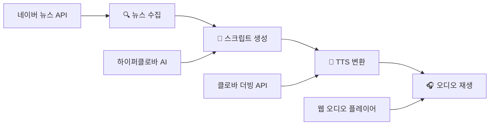
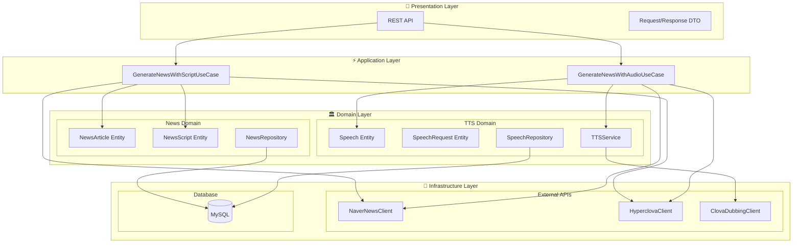
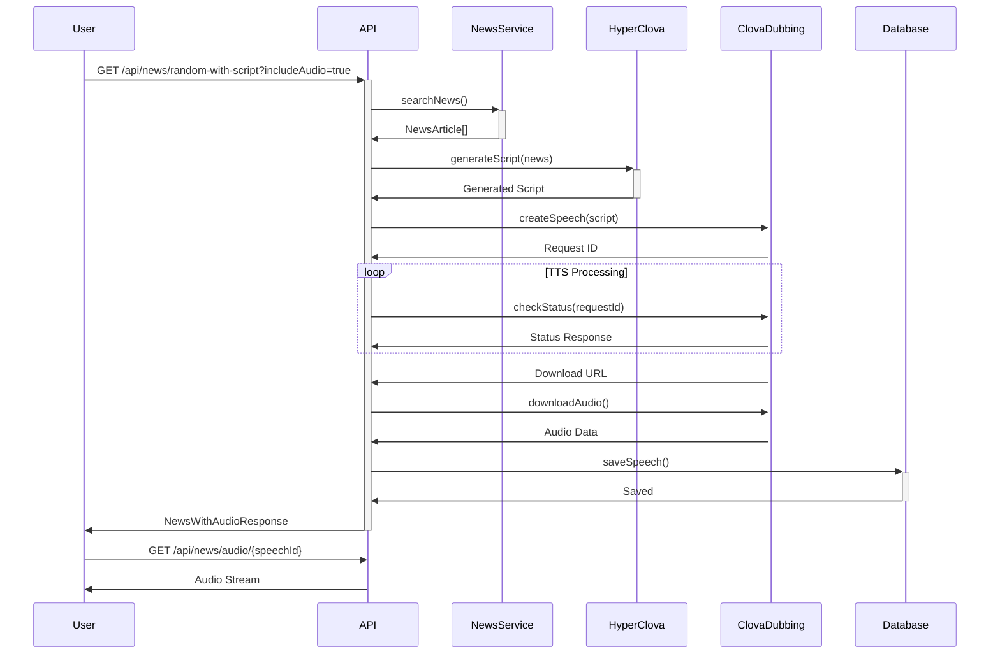
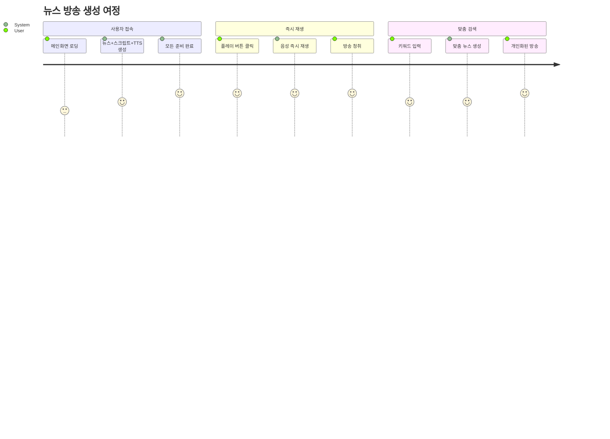
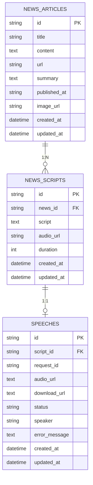
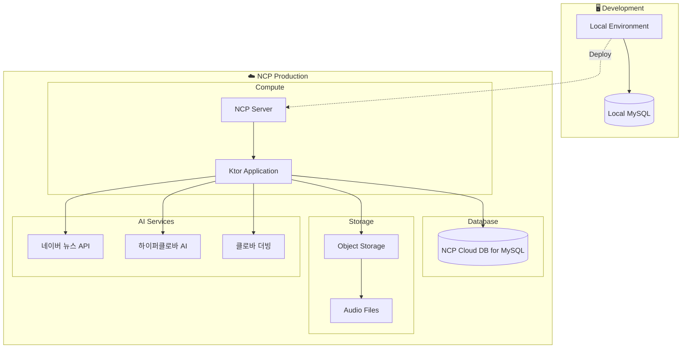
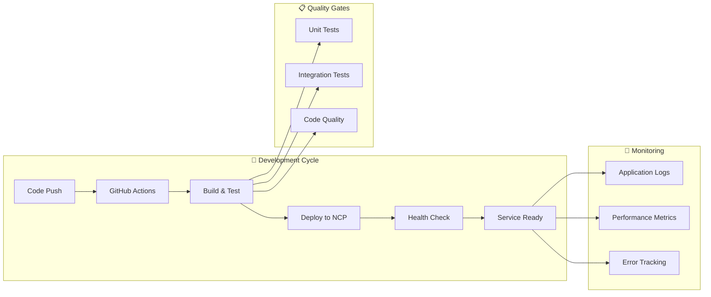
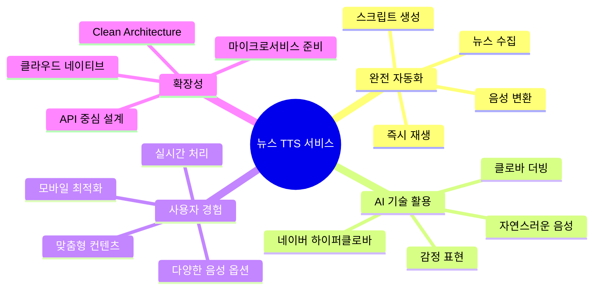

# 🎬 워크플로우 및 다이어그램

뉴스 스크립트 TTS 생성 서비스의 상세 워크플로우와 시각화 자료

## 🎯 서비스 워크플로우

## 🏗️ 시스템 아키텍처

## 🔗 API 플로우

## 🔄 사용자 시나리오

## 📊 데이터베이스 ERD

## 🌐 배포 아키텍처

## 🚀 CI/CD 파이프라인

## 💡 서비스 혁신 포인트

---

*이 문서의 모든 다이어그램은 Mermaid 문법으로 작성되어 GitHub에서 바로 확인할 수 있습니다! 🎯*
